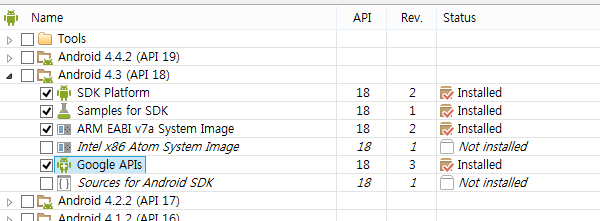
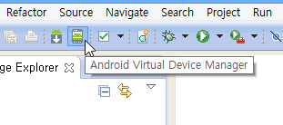
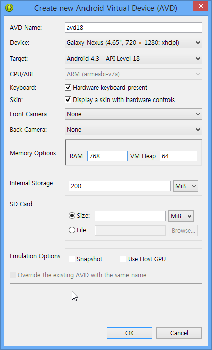
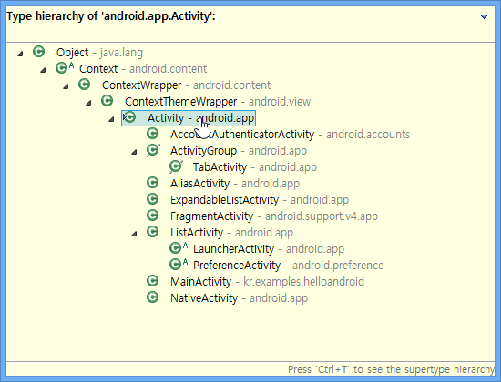

## To Read
* 모바일 앱개발의 다섯가지 실수 http://www.memoriesreloaded.net/2014/01/blog-post_30.html
* 14-02-01 기술 뉴스 http://blog.outsider.ne.kr/1025
* Gmail Hack check  http://www.businessinsider.com/how-to-find-out-if-gmail-was-hacked-2014-1


2월 안드로이드 개발 방송 시작합니다.
잠시 후 11:40부터 프로그래밍 방송 시작합니다.
http://afreeca.com/kenuheo

----
# 안드로이드 개발
[TOC]

## 1강	안드로이드 개요
### 개요
* http://www.android.com/ 
  * 안드로이드 정보를 볼 수 있는 사이트입니다.
* http://developer.android.com/index.html 
  * 안드로이드 개발자를 위한 사이트
  * 안드로이드 개발도구
  * 개발 가이드, 튜토리얼, 레퍼런스

### 아이폰 대항마
- 아이폰 2007 (2005)
- 안드로이드 2008 (2003)
- 앤디 루빈 사장 삼성전자 방문 에피소드
  http://estima.wordpress.com/2011/06/30/andyrubin/
- OHA http://www.openhandsetalliance.com/

### 안드로이드 버전
|안드로이드(코드명) | 개발버전 | 출시일 |
|-------|------|-------|
|1.0(apple pie) | API Level 1 | 2008/09/23 |
|1.1(banana bread) | API Level 2 | 2009/02/09 |
|1.5(cupcake) | API Level 3 | 2009/04/30 |
|1.6(donut) | API Level 4 | 2009/09/15 |
|2.0(eclair) | API Level 7 | 2009/10/26 |
|2.2(froyo) | API Level 8 | 2010/05/20 |
|2.3(gingerbread) | API Level 10 | 2010/12/06 |
|3.0(honeycomb) | API Level 13 | 2011/02/22 |
|4.0(ice cream sandwich) | API Level 15 | 2011/10/19 |
|4.3(Jelly Bean) | API Level 18 | 2012/06/27 |
|4.4(KitKat) | API Level 19 | 2013/01/01 |


### 개발을 위해서 필요한 것
* JDK http://java.sun.com/
* eclipse or intellij 개발도구
* ADT (안드로이드 개발 SDK)
* 에뮬레이터 또는 디바이스

## 2강	안드로이드 개발환경
### 설치
1. JDK
2. 이클립스(ADT 번들; +Android SDK, +ADT Plugin)
3. 에뮬레이터 또는 디바이스

#### 1. JDK
* http://java.sun.com/ 사이트에서 JavaSE JDK를 다운로드하고 설치
* 1.6 이상

#### 2. 이클립스 (ADT번들)
* http://developer.android.com/sdk/ 페이지에서 다운로드하고 압축해제
* 적당한 위치
  * 예 C:\dev\android 또는 /Users/kenu/dev/android
  * 경로에 한글명 피할 것
* eclipse : ADT Bundle
* IntelliJ : Android Studio
  * EARLY ACCESS PREVIEW 0.4 (2014/02)

#### 3. 에뮬레이터
* 속도 느림 감수
  * 권장: **디바이스**, 또는 Genymotion ( http://genymotion.com )
  * genymotion 관련 글 http://okjsp.tistory.com/tag/genymotion
* SDK Manager로 플랫폼 버전 선택
  * 4.3 권장 (2014/02)
  


### 개발도구 인코딩 utf-8
eclipse.ini
마지막 줄에 -Dfile.encoding=utf-8 추가

### 개발도구 시작
#### eclipse 실행
workspace 위치 c:\dev\android\workspace

#### SDK Manager
* 개발 플랫폼 다운로드
  * (2014/02) 4.3기준
  * 
* 플랫폼 다운로드 완료 후 이클립스 재실행 권장
  * Target에서 버전이 안 보이는 현상

#### AVD 만들기
1. AVD Manager 실행  
  
2. New 버튼 클릭
3. Target 항목: Android 4.3 API 18  
  
4. Device Galaxy Nexus 4.65" 720 x 1280 xhdpi
5. 윈도우의 경우 Memory를 768M 이하로 조정  
  
6. AVD이름 avd18
7. avd18 선택 후 Start 버튼 클릭
8. 5분 정도 기다려야 부팅 완료


## 3강	안드로이드 Manifest
### 안드로이드 프로젝트 만들기
1. Java 퍼스펙티브
2. File > New > Android Application Project 선택
3. Application Name : Hello Android
4. Project Name : HelloAndroid
5. package : kr.examples.helloandroid
6. Next
7. Custom Icon 체크해제
8. Next * 2

### 안드로이드 폴더와 파일 구조

#### 프로젝트 폴더 구성
```
kenu@WIN-TTOOQBJVG5D /c/dev/android/workspace/HelloAndroid
$ find . -type d
// 안드로이드 폴더 구성
./.settings <- 이클립스 설정 정보
./assets    <- 로컬 자원(이미지, html)
./bin       <- 클래스 자동 생성 폴더
./gen       <- apk 빌드되는 곳
./libs      <- jar 파일
./res       <- 인덱싱되는 리소스 R.java 연관
./res/drawable-hdpi  <- 이미지(소문자,0-9,_)
./res/layout <- xml ui파일 뷰역할
./res/menu   <- 안드로이드 메뉴
./res/values <- 문자열, 다국어, 기기별
./src        <- 자바 코드 기준 폴더
./src/kr
./src/kr/examples
./src/kr/examples/helloandroid
```
#### 프로젝트 주요 파일
1. AndroidManifest.xml
2. MainActivity.java
3. activity_main.xml : UI xml
4. 언터처블 R.java

##### AndroidManifest.xml
* LAUNCHER 단어 검색
* 제일 먼저 실행되는 Activity 클래스가 포함하고 있음
* 클래스 명 위치에서 F3키로 선언 위치로 이동

##### MainActivity.java
* onCreate() 메소드에서 UI xml 확인
* activity_main 선택하고 ctrl+shift+R
* Open Resources 창에서 선택

##### activity_main.xml
```xml
    <TextView
        android:layout_width="wrap_content"
        android:layout_height="wrap_content"
        android:text="@string/hello_world" />
```

##### strings.xml
```xml
    <string name="hello_world">Hello world!</string>
```

### 프로젝트 실행
1. 에뮬레이터 실행하거나 디바이스 연결
2. 프로젝트 실행
  * 프로젝트 선택
  * 메뉴에서 Run > Run as > Android Application
    * 또는 ctrl+F11
    * 또는 컨텍스트 메뉴 > Run as > Android Application

#### LogCat
* 안드로이드 에뮬레이터 또는 디바이스 원격 로그 뷰어


## 4강	액티비티
* 액티비티는 화면단위

### 액티비티 라이프사이클

image from: http://commons.wikimedia.org/wiki/File:Android_doc-basic_lifecycle.png


### 액티비티 상속구조


### 액티비티 전환
* 서브 액티비티 추가
* 레이아웃 xml 추가하고 서브 액티비티와 연결
* 메인 액티비티에 버튼 추가
* 버튼에 이벤트 추가
* 이벤트에서 서브 액티비티 호출
* 서브 액티비티 닫기 버튼 추가
* 닫기 버튼 이벤트 추가
* 닫기 이벤트 처리


#### 버튼 이벤트 처리
* 버튼 찾기  
```java
Button button = (Button) findViewById(R.id.button1);
```

* 버튼에 이벤트 리스너 붙이기
* 이벤트 처리 메소드 완성
```java
button.setOnClickListener(new View.OnClickListener() {
    @Override
    public void onClick(View v) {
        Intent intent = new Intent(getApplicationContext(),
                SubActivity.class);
        startActivity(intent);
    }
});
```

#### Intent
```java
Intent intent = new Intent(getApplicationContext(),
        SubActivity.class);
startActivity(intent);
```

## 5강	뷰/뷰그룹

### 뷰
* UI컴포넌트의 기본 단위
* 화면에서 직사각형 영역을 차지
* 그리기, 이벤트 처리를 담당
* UI 위젯(widget)의 기본 베이스

### 뷰그룹
* 레이아웃을 위한 기본 클래스
* 뷰 또는 뷰그룹을 감싸는 컨테이너 역할
* 외형이 없음
* LinearLayout, FrameLayout, RelativeLayout

## 6강	안드로이드 위젯
### 위젯
* UI 콘트롤
* android.widgets.*
* Input Control
  * buttons, text fields, seek bars, checkboxes, zoom buttons, toggle buttons, and many more.
  * Button
  * Text Field
  * CheckBox
  * Radio button
  * Toggle button
  * Spinner
  * Pickers

### 앱 위젯
* 미니어처 애플리케이션 뷰
* 바탕화면 위치


## 7강	안드로이드 코드 리뷰
### 노트패드 튜토리얼

http://developer.android.com/training/notepad/index.html

* 1단계
  * 목록 기본
  * 메뉴 다루기
  * SQLite DB 사용
* 2단계
  * 액티비티에서 다른 액티비티로 데이터 전달, 버튼 이벤트
* 예외 발생 처리하고, 리팩토링

#### 1단계
* 프로젝트 가져오기
  * File > New > Project... > Android Project from Existing Code
* DAO 리뷰
* 목록 UI xml 작업

## 8강	토스트, 다이얼로그
### 토스트

* 잠깐 뜨는 작은 메시지 창
* 디버깅용 메시지로 많이 사용
```java
Toast.makeText(getApplicationContext(), "message", Toast.LENGTH_SHORT).show();
```

### 다이얼로그

* 메시지를 전하고, 인터랙션을 기대하는 창
* 사용자의 액션이 필요
```java
package tv.okdev.dialogtest;

import android.app.Activity;
import android.app.AlertDialog;
import android.app.AlertDialog.Builder;
import android.app.Dialog;
import android.content.DialogInterface;
import android.os.Bundle;
import android.view.View;
import android.widget.Button;
import android.widget.Toast;

public class MainActivity extends Activity {

	private static final int DIALOG_MESSAGE = 10;

	@Override
	protected void onCreate(Bundle savedInstanceState) {
		super.onCreate(savedInstanceState);
		setContentView(R.layout.activity_main);
		Button button = (Button) findViewById(R.id.button1);

		button.setOnClickListener(new View.OnClickListener() {
			@Override
			public void onClick(View v) {
				showDialog(DIALOG_MESSAGE);
			}
		});
	}

	@Override
	protected Dialog onCreateDialog(int id) {
		switch (DIALOG_MESSAGE) {
		case 10:
			Builder builder = new AlertDialog.Builder(this);
			builder.setMessage("This will end the activity");
			builder.setCancelable(true);
			builder.setPositiveButton("I agree", new OkOnClickListener());
			builder.setNegativeButton("No, no", new CancelOnClickListener());
			AlertDialog dialog = builder.create();
			dialog.show();
		}
		return super.onCreateDialog(id);
	}

	private final class CancelOnClickListener implements
			DialogInterface.OnClickListener {
		public void onClick(DialogInterface dialog, int which) {
			Toast.makeText(getApplicationContext(), "Activity will continue",
					Toast.LENGTH_LONG).show();
		}
	}

	private final class OkOnClickListener implements
			DialogInterface.OnClickListener {
		public void onClick(DialogInterface dialog, int which) {
			MainActivity.this.finish();
		}
	}

}
// code from : http://www.vogella.com/tutorials/AndroidDialogs/article.html
```

## 8.5 Fragment
* http://developer.android.com/guide/components/fragments.html
* http://www.vogella.com/tutorials/AndroidFragments/article.html


## 9강	이미지
### 로컬
* res/drawable
* 파일명 규칙
  * a-z0-9_-.
  * 확장자 무시
  * 해상도별 폴더
    * ldpi -> mdpi -> hdpi -> xhdpi

### 원격 이미지


## 10강	파일 활용
## 11강	로컬 데이터베이스 활용
## 12강	원격 JSON 데이터 처리
## 13강	원격 XML 처리
## 14강	Notification
## 15강	구글 클라우드 메시지 GCM
## 16강	전화 제어
## 17강	위치 정보 활용
## 18강	네트워크 활용
## 19강	멀티미디어 처리
## 20강	카메라
